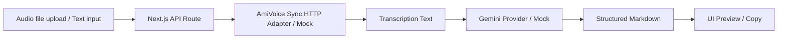

# amivoice-ai-structuring-poc

AmiVoice APIで音声を文字起こしし、Gemini APIで業務ドキュメント用のMarkdown
（Issue / ふりかえりKPT）に構造化するPoC（概念実証）アプリケーションです。

> 音声認識の価値は、単に正確な文字起こしをすることではない。
> 未整理の発話を、生成AIで安全に業務ドキュメントへ構造化できることに価値がある。

このREADMEだけで、第三者がこのPoCの意図と使い方を理解できることを目指しています。
詳細な設計判断は [docs/architecture.md](./docs/architecture.md)、評価結果は
[docs/evaluation.md](./docs/evaluation.md) を参照してください。

## 背景

作業中に気づいた不具合、調査中の違和感、まだタスク化できていない改善案、
ふりかえりの発話などは、音声で話す方が入力のハードルは低いものの、
文字起こしされただけのテキストは「あとで読み返しても使いにくいメモ」に
なりがちです。

このPoCは、AmiVoiceで文字起こししたテキストをGeminiで構造化することで、
「もやもやした音声メモ」を「業務でそのまま使えるMarkdown」に変換できるか
を検証するものです。

## このPoCで検証したいこと

```text
音声認識結果を、生成AIで業務ドキュメントへ安全に構造化する設計知見を示すこと
```

具体的には以下の観点を検証します。

- 入力にないことを断定せず、事実と推測を分離できるか
- 曖昧な内容を勝手に補完せず、未確認事項として残せるか
- 発話者の違和感・不安・感情を、要約で消しすぎずに残せるか
- 出力が、そのままIssueやふりかえりノートに貼って使えるMarkdownになるか
- 音声認識特有の誤変換に対して、断定せず確認候補として扱えるか

## このPoCでやること

- 音声ファイルアップロードによる文字起こし（AmiVoice API / mock）
- テキスト直接入力
- 文字起こし結果のGeminiによる構造化（Gemini API / mock）
- Issue Mode（調査メモ・違和感 → Issue用Markdown）
- Reflection Mode（ふりかえり音声 → KPT + 確認事項）
- Markdown表示・コピー
- サンプル8件（Issue 5件 / Reflection 3件）と評価メモ
- mock providerによる、APIキーなしでの動作確認

## このPoCでやらないこと

- ユーザー認証・複数ユーザー対応
- DBへの保存・履歴管理
- GitHub / Gitea Issue APIへの自動登録
- 本番デプロイ・CI/CD
- ブラウザでの録音機能（音声ファイルアップロードのみ）
- 長時間音声向けの非同期ジョブ管理
- WebSocketによるリアルタイム文字起こし
- 音声データの永続保存

## 技術スタック

- [Next.js](https://nextjs.org/)（App Router） + TypeScript + React
- Next.js API Routes（Node.js runtime）
- [AmiVoice API](https://docs.amivoice.com/)（同期HTTPインターフェース）
- [Gemini API](https://ai.google.dev/)（`generateContent` REST エンドポイント）
- Markdown表示: `react-markdown` + `remark-gfm`
- スタイリング: Tailwind CSS
- APIキー管理: `.env.local`

## セットアップ方法

```bash
git clone <このリポジトリ>
cd amivoice-ai-structuring-poc
npm install
cp .env.example .env.local
npm run dev
```

`http://localhost:3000` を開くとトップページが表示されます。
（ポートが使用中の場合は `3001` などにフォールバックします。起動ログを確認してください）

## `.env.example` の説明

`.env.example` は、`.env.local` に設定可能な環境変数のテンプレートです。

```env
# --- AmiVoice ---
AMIVOICE_API_KEY=
AMIVOICE_API_ENDPOINT=https://acp-api.amivoice.com/v1/nolog/recognize
AMIVOICE_GRAMMAR_FILE_NAMES=-a-general
AMIVOICE_KEEP_FILLER_TOKEN=0

# --- Gemini ---
GEMINI_API_KEY=
GEMINI_MODEL=gemini-3.5-flash

# --- Provider selection ---
TRANSCRIPTION_PROVIDER=mock   # mock | amivoice
LLM_PROVIDER=mock             # mock | gemini
```

| 変数名 | 説明 |
| --- | --- |
| `AMIVOICE_API_KEY` | AmiVoiceのAPIキー。サーバーサイドのみで使用。未設定ならmock provider。 |
| `AMIVOICE_API_ENDPOINT` | 同期HTTP認識エンドポイント。ログ保存なし(`nolog`)がデフォルト。 |
| `AMIVOICE_GRAMMAR_FILE_NAMES` | `d`パラメータの`grammarFileNames`。デフォルト`-a-general`。 |
| `AMIVOICE_KEEP_FILLER_TOKEN` | `1`にするとフィラー（「えーと」等）を残す。デフォルト`0`（除去）。 |
| `GEMINI_API_KEY` | Gemini APIキー。サーバーサイドのみで使用。未設定ならmock provider。 |
| `GEMINI_MODEL` | 使用するGeminiモデル名。デフォルト`gemini-3.5-flash`。 |
| `TRANSCRIPTION_PROVIDER` | `mock` または `amivoice`。`amivoice`指定でもキー未設定なら自動的に`mock`。 |
| `LLM_PROVIDER` | `mock` または `gemini`。`gemini`指定でもキー未設定なら自動的に`mock`。 |

**重要:** `NEXT_PUBLIC_` を付けた環境変数にAPIキーを入れないでください。
`.env.local` は `.gitignore` に含まれており、Gitにコミットされません。

## mock providerでの起動方法

何も設定しなくても、デフォルトでmock providerが使われます。

```bash
npm install
npm run dev
```

`/convert` を開くと、以下が確認できます。

- テキストを直接入力して「構造化のみ実行」→ Issue Mode / Reflection Mode の
  Markdownが生成される
- 音声ファイル（任意のファイルでよい。中身は読まれません）を選択して
  「文字起こしのみ実行」→ 固定のmock文字起こし結果が返る
- 同じファイルで「文字起こし + 構造化」→ mock文字起こし結果がmock構造化される

画面上部の「文字起こし provider」「構造化 provider」が両方とも `mock`
と表示されていれば、APIキーなしで動作しています。

## 実APIでの起動方法（実API検証手順）

mockではなく実APIで、以下の正常系を確認するための手順です。

```text
音声ファイル → AmiVoice実API → 文字起こし → Gemini実API → 構造化Markdown
```

### 0. 検証用の音声ファイルを用意する

- **数秒〜十数秒程度の短い音声ファイル**（wav / mp3 など）を用意してください。
  - このPoCが対象とする「短い音声メモ」のユースケースに合わせており、
    AmiVoiceの同期HTTPインターフェースもそうした短い音声向けです。
  - 長い音声はアップロードサイズやAPIのタイムアウト、Geminiへの入力長の
    観点で検証に適さないため、まずは短いファイルで一連の流れを確認してください。
  - 内容は「明日までにログインAPIのエラーを調査する」のような、短い
    業務メモ・つぶやき程度で十分です。
- 音声ファイルはメモリ上でのみ扱われディスクには保存されないため、
  検証後にファイルを削除する必要はありません（アプリ側には残りません）。

### 1. APIキーを取得する

- AmiVoice: AmiVoiceのアカウントでAPIキー（Application ID）を取得します。
- Gemini: Google AI StudioでAPIキーを取得します。

### 2. `.env.local` を編集する

```env
AMIVOICE_API_KEY=your-amivoice-api-key
TRANSCRIPTION_PROVIDER=amivoice

GEMINI_API_KEY=your-gemini-api-key
GEMINI_MODEL=gemini-2.0-flash   # 自分のAPIキーで利用可能なモデル名に置き換える
LLM_PROVIDER=gemini
```

`.env.example` の `GEMINI_MODEL` のデフォルト値（`gemini-3.5-flash`）は、
利用しているAPIキー・プロジェクトで必ず使えるとは限りません。Google AI
Studio等で利用可能なモデル名を確認し、`GEMINI_MODEL` を実際に使えるモデル名
に置き換えてください。モデル名が不正な場合、`/convert` の構造化結果に
「Gemini APIがエラーを返しました」と表示され、`details` に
`HTTP 404 NOT_FOUND: ...` のようなGemini側のエラーメッセージが含まれます。

### 3. サーバーを再起動する

```bash
npm run dev
```

`.env.local` を変更した場合は、開発サーバーを再起動（停止して
`npm run dev` を再実行）してください。`src/lib/env.ts` の `env` は
プロセス起動時に一度だけ `process.env` から読み込まれるため、
再起動しないと新しい値が反映されません。

### 4. providerが切り替わったことを確認する

`/convert` を開き、画面上部の「文字起こし provider」「構造化 provider」が
それぞれ `amivoice` / `gemini` になっていることを確認します。
`mock` のままの場合は、APIキーが空、またはタイポがある可能性があります
（`resolveTranscriptionProvider()` / `resolveLlmProvider()` がAPIキー未設定時に
自動的に `mock` へフォールバックするため）。

### 5. 文字起こしのみで確認する

`/convert` で、手順0で用意した短い音声ファイルを選択し、
「文字起こしのみ実行」を押します。AmiVoiceからの応答が文字起こし結果として
表示されれば成功です。

curlで直接確認する場合:

```bash
curl -s -X POST http://localhost:3000/api/transcribe \
  -F "file=@./sample.wav" | jq
```

### 6. 文字起こし + 構造化で確認する（正常系の本番フロー）

同じ音声ファイルを使い、「文字起こし + 構造化」を押します。AmiVoiceの
文字起こし結果がそのままGeminiへの入力となり、Issue Mode /
Reflection Modeに応じた構造化Markdownが表示されれば、冒頭の正常系
（音声ファイル → AmiVoice実API → 文字起こし → Gemini実API → 構造化Markdown）
が確認できたことになります。

curlで直接確認する場合:

```bash
curl -s -X POST http://localhost:3000/api/transcribe-and-structure \
  -F "file=@./sample.wav" \
  -F "mode=issue" | jq
```

### 7. 構造化のみ（テキスト直接入力）で確認する

文字起こし結果をテキスト欄にコピーするか、任意のテキストを直接入力した
状態で「構造化のみ実行」を押し、Geminiの構造化Markdownが表示されることを
確認します。

```bash
curl -s -X POST http://localhost:3000/api/structure \
  -H "Content-Type: application/json" \
  -d '{"mode":"issue","text":"ここに文字起こし結果のテキストを入れる"}' | jq
```

---

AmiVoiceとGeminiは独立して切り替え可能です。たとえば
「文字起こしは実APIだが構造化はmock」という組み合わせでも動作します。

## AmiVoice API設定

- 使用するインターフェースは **同期HTTPインターフェース** です。
  - ログ保存なし（デフォルト）: `https://acp-api.amivoice.com/v1/nolog/recognize`
  - ログ保存あり: `https://acp-api.amivoice.com/v1/recognize`
    （`AMIVOICE_API_ENDPOINT` で切り替え）
- リクエストは `multipart/form-data` で、`u`（APIキー）・`d`（認識パラメータ）・
  `a`（音声バイナリ）を送信します。
- `d` パラメータは `grammarFileNames=-a-general keepFillerToken=0` を
  デフォルトとし、`AMIVOICE_GRAMMAR_FILE_NAMES` / `AMIVOICE_KEEP_FILLER_TOKEN`
  で変更できます。
- フィラー（「えーと」「あの」等）は、構造化のしやすさを優先してデフォルトでは
  除去（`keepFillerToken=0`）します。発話の違和感・感情を分析したい場合は
  `AMIVOICE_KEEP_FILLER_TOKEN=1` に変更してください。
- 実装は `src/lib/amivoice/amivoiceSyncHttpClient.ts` を参照してください。

## Gemini API設定

- `GEMINI_API_KEY` と `GEMINI_MODEL`（デフォルト`gemini-3.5-flash`）で設定します。
- Gemini APIの `generateContent` エンドポイントを `fetch` で直接呼び出しています
  （追加SDKは使用していません）。
- APIキーはHTTPヘッダー `x-goog-api-key` で送信し、URLには含めません。
- 実装は `src/lib/llm/geminiClient.ts` を参照してください。

## 使い方

### `/`（トップ画面）

PoCの概要、Issue Mode / Reflection Modeの説明、`/convert` と `/samples` への
リンクを表示します。

### `/convert`（変換画面）

1. モード（Issue Mode / Reflection Mode）を選択する。
2. 音声ファイルをアップロードするか、テキストを直接入力する。
3. 目的に応じてボタンを押す。
   - **文字起こしのみ実行**: 音声ファイルがある場合のみ有効。
   - **構造化のみ実行**: テキスト入力欄に内容がある場合のみ有効。
   - **文字起こし + 構造化**: 音声ファイルがある場合のみ有効。
4. 結果（音声ファイル情報・文字起こし結果・構造化Markdown）が画面に表示される。
5. 「Markdownをコピー」でクリップボードにコピーできる。

画面上部には、現在の provider 状態（mock / real）と、APIキー未設定により
mockへフォールバックしている場合の案内が表示されます。

### `/samples`（サンプル画面）

Issue Mode 5件、Reflection Mode 3件のサンプル（入力テキスト・出力Markdown・
評価メモ）を確認できます。

## Issue Modeの説明

雑多な音声メモから、GitHub/Gitea Issueに貼り付けられるMarkdownを生成します。

**入力例:** 作業中に気づいた不具合、調査中の違和感、まだタスク化できていない
改善案、後で確認したいこと、エラー調査中のメモ、顧客からの問い合わせメモ など。

**出力に含まれる項目:** タイトル案 / 概要 / 文字起こし信頼度 / 背景 /
起きていること / 期待する状態 / 事実 / 推測 / 調査済みのこと / 未確認事項 /
文字起こし確認候補 / リスク・注意点 / 次にやること /
Issue本文として使う場合の貼り付け用Markdown

**重要な設計方針:**

- 入力にないことを断定しない
- 事実と推測を分離する
- 曖昧なことは確認事項に回す
- そのままIssue本文に貼れるMarkdownにする
- 発話者の違和感や不安を消しすぎない
- 音声認識特有の誤認識・表記揺れ（特に動詞・状態表現）は「文字起こし確認候補」
  として分離し、断定的な事実として扱わない
- 入力全体の「文字起こし信頼度」（高/中/低）を判定し、信頼度が「低」の
  場合はタイトルを含む本文全体で補正候補の断定・コマンドの実行済み扱い・
  不明な略語の勝手な展開を抑制する

プロンプトの実装は [src/lib/prompts/issuePrompt.ts](./src/lib/prompts/issuePrompt.ts) を参照してください。

## Reflection Modeの説明

新人や学習者のふりかえり音声から、KPTと確認事項を生成します。

**入力例:** 今日やったこと、分かったこと、詰まったこと、不安に感じていること、
次に確認したいこと、メンターに相談したいこと、理解が曖昧な箇所 など。

**出力に含まれる項目:** 今日やったこと / Keep / Problem / Try / 分かったこと /
まだ曖昧なこと / メンターへの確認事項 / 次回の行動案 /
ふりかえり本文として使う場合の貼り付け用Markdown

**重要な設計方針:**

- 単なる感想要約にしない
- KPT・確認事項・次アクションに分解する
- 学習者の不安や違和感を消しすぎない（フィラーや言い淀みは整理してよい）
- 入力にない成長や理解を勝手に補完しない

プロンプトの実装は [src/lib/prompts/reflectionPrompt.ts](./src/lib/prompts/reflectionPrompt.ts) を参照してください。

## アーキテクチャ概要



詳細なデータフロー・provider切り替え・設計判断（なぜDBやIssue API連携を
使わないか等）は [docs/architecture.md](./docs/architecture.md) を参照してください。

主なディレクトリ構成:

```text
src/
├── app/
│   ├── page.tsx                # トップ画面
│   ├── convert/page.tsx        # 変換画面
│   ├── samples/page.tsx        # サンプル画面
│   └── api/
│       ├── transcribe/route.ts
│       ├── structure/route.ts
│       └── transcribe-and-structure/route.ts
├── components/                 # UIコンポーネント
├── lib/
│   ├── amivoice/                # AmiVoice adapter (sync HTTP / mock)
│   ├── llm/                      # Gemini provider / mock
│   ├── prompts/                  # Issue / Reflection プロンプト
│   ├── samples/                  # サンプルデータ定義
│   └── env.ts                    # 環境変数アクセスの集約
└── types/                       # API共通型定義

samples/                          # サンプルの入力/出力Markdown
docs/                             # ドキュメント
```

## サンプル

`/samples` 画面、または `samples/issue/` ・ `samples/reflection/`
ディレクトリ内のMarkdownファイルを参照してください。

| サンプル | 内容 |
| --- | --- |
| `samples/issue/issue-01-*` | k8s Pod CrashLoopBackOff・環境変数の反映漏れ調査 |
| `samples/issue/issue-02-*` | ライブラリv3アップデート後のページネーション仕様差分 |
| `samples/issue/issue-03-*` | 夜間バッチ失敗・音声認識誤変換を含む技術メモ |
| `samples/issue/issue-04-*` | 夜間バッチ失敗・動詞の誤認識（「回避されている」）を含む技術メモ |
| `samples/issue/issue-05-*` | 技術用語が密集する音声メモ・文字起こし信頼度「低」のケース |
| `samples/reflection/reflection-01-*` | オンボーディング3日目・環境構築のつまずき |
| `samples/reflection/reflection-02-*` | useEffectの学習・分かったつもりだが不安が残る |
| `samples/reflection/reflection-03-*` | レビュー指摘の意図が掴めない相談前メモ |

## 評価観点

サンプルおよび実際の出力は、以下の観点で評価しています（詳細は
[docs/evaluation.md](./docs/evaluation.md)）。

1. 事実と推測が分離されているか
2. 次の行動に移せるか
3. 余計な断定がないか
4. 音声メモの違和感や感情が失われていないか
5. 業務ドキュメントとして貼れるか

3段階評価: `3 = そのまま使える` / `2 = 軽微な修正で使える` /
`1 = そのままでは危険または不足`

## 既知の制約

- 音声ファイルは短時間のものを想定しており、長時間音声・非同期処理には未対応。
- 文字起こし・構造化結果はページ内にのみ保持され、リロードすると失われる
  （履歴管理なし）。
- mock providerの出力は固定テンプレートであり、実際のGemini API出力とは
  文章表現が異なる。
- 認証機能がないため、そのままインターネットに公開する用途は想定していない。

## トラブルシューティング

| 症状 | 確認すること |
| --- | --- |
| `/convert` で provider が常に `mock` のまま | `.env.local` の `TRANSCRIPTION_PROVIDER` / `LLM_PROVIDER` と、対応するAPIキーが設定されているか確認してください。設定後はサーバーの再起動が必要です。 |
| 「AMIVOICE_API_KEY is not set」エラー | `.env.local` に `AMIVOICE_API_KEY` を設定するか、`TRANSCRIPTION_PROVIDER=mock` のまま使用してください。 |
| 「GEMINI_API_KEY is not set」エラー | `.env.local` に `GEMINI_API_KEY` を設定するか、`LLM_PROVIDER=mock` のまま使用してください。 |
| AmiVoice APIエラー（`code`/`message`が表示される） | 音声ファイルの形式・サイズ、APIキーの有効性を確認してください。画面に表示される `details` の `code=...: message` がAmiVoice側のエラー内容です。 |
| Gemini APIエラー（`HTTP <status> <API側のstatus>: <message>`が表示される） | `details` に表示されるGemini側の `message` を確認してください。`API_KEY_INVALID` ならAPIキーの設定ミス、`models/... is not found` なら `GEMINI_MODEL` のモデル名が利用可能なものになっていない可能性があります。 |
| 構造化結果が空、または文字起こし結果が空 | 入力テキスト・音声ファイルの内容を見直し、再度実行してください。 |
| 音声ファイル未選択でボタンが押せない | 「文字起こしのみ実行」「文字起こし + 構造化」は音声ファイル選択時のみ有効です。 |
| テキスト未入力で「構造化のみ実行」が押せない | テキスト直接入力欄に内容を入力するか、先に文字起こしを実行してください。 |

## Zenn記事用メモへのリンク

このPoCをもとにしたZenn記事の下書き材料は
[docs/article-notes.md](./docs/article-notes.md) を参照してください。
記事タイトル案、主張、実装で迷った点、失敗例・改善例などをまとめています。

## ライセンス

[LICENSE](./LICENSE) を参照してください。
