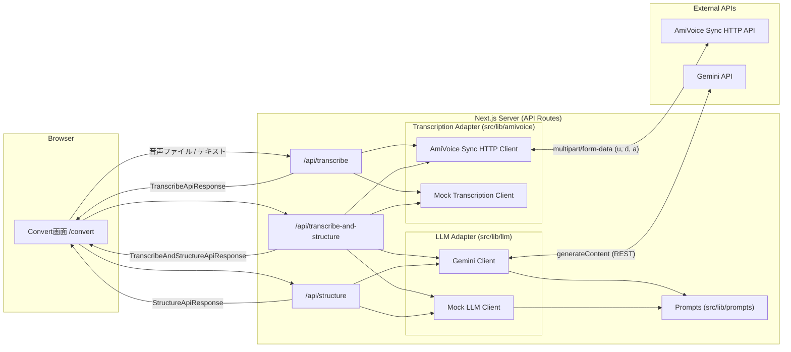

# architecture.md

このドキュメントは、`amivoice-ai-structuring-poc` の全体構成・データフロー・
provider切り替え・主な設計判断（なぜそうしたか）をまとめたものです。

## 全体構成



## データフロー

### 1. テキスト直接入力 → 構造化のみ

```text
Convert画面 (text)
  -> POST /api/structure { mode, text }
  -> getLlmClient() (Gemini or Mock)
  -> プロンプト生成 (issuePrompt / reflectionPrompt)
  -> StructureApiResponse { markdown, provider, mode }
  -> Convert画面で表示・コピー
```

### 2. 音声ファイル → 文字起こしのみ

```text
Convert画面 (audio file)
  -> POST /api/transcribe (multipart/form-data: file)
  -> getTranscriptionClient() (AmiVoice or Mock)
  -> AmiVoice Sync HTTP API (multipart: u, d, a) または Mock
  -> TranscribeApiResponse { text, provider, raw? }
  -> Convert画面のテキスト欄に反映
```

### 3. 音声ファイル → 文字起こし + 構造化

```text
Convert画面 (audio file + mode)
  -> POST /api/transcribe-and-structure (multipart/form-data: file, mode)
  -> 文字起こし (AmiVoice or Mock)
  -> 構造化 (Gemini or Mock, 文字起こし結果のtextを入力に使用)
  -> TranscribeAndStructureApiResponse { transcription, structured }
  -> Convert画面で両方を表示・コピー
```

## provider構成

| 種別             | mock                        | real                              |
| ---------------- | --------------------------- | --------------------------------- |
| 文字起こし       | `MockTranscriptionClient`   | `AmiVoiceSyncHttpClient`           |
| 構造化（LLM）    | `MockLlmClient`              | `GeminiClient`                     |

- `src/lib/amivoice/index.ts` の `getTranscriptionClient()` が、環境変数に応じて
  `AmiVoiceSyncHttpClient` か `MockTranscriptionClient` を返す。
- `src/lib/llm/index.ts` の `getLlmClient()` が、環境変数に応じて `GeminiClient` か
  `MockLlmClient` を返す。
- どちらも `TranscriptionClient` / `LlmClient` という共通インターフェースを実装しており、
  API Route側は provider の違いを意識せず呼び出せる。

```ts
// src/lib/amivoice/index.ts (抜粋)
export const getTranscriptionClient = (): TranscriptionClient => {
  if (resolveTranscriptionProvider() === "amivoice") {
    return new AmiVoiceSyncHttpClient();
  }
  return new MockTranscriptionClient();
};
```

## mock / real切り替え

切り替えは `.env.local` の以下の変数で行う。

```env
TRANSCRIPTION_PROVIDER=mock   # mock | amivoice
LLM_PROVIDER=mock             # mock | gemini
```

ただし、単に `amivoice` / `gemini` を指定するだけでは不十分で、対応するAPIキー
（`AMIVOICE_API_KEY` / `GEMINI_API_KEY`）が設定されていない場合は、
`src/lib/env.ts` の `resolveTranscriptionProvider()` / `resolveLlmProvider()` が
自動的に `mock` にフォールバックする。

これにより、

- `.env.local` を作らなくても（あるいはAPIキーだけ未設定でも）アプリ全体が動く
- 「real providerを指定したのにキーがない」状態でも、エラーで止まらず
  mockにフォールバックしつつ、画面上に警告（`ProviderStatus`コンポーネント）を表示する

という2つの要件を両立している。

## なぜDBを使わないか

- このPoCの目的は「構造化の設計」を検証・デモすることであり、結果の永続化や
  履歴管理はスコープ外。
- 出力はその場で画面表示・Markdownコピー・サンプルファイル参照で完結させることで、
  DBスキーマ設計・マイグレーション・永続化層のテストといった、本題と関係のない
  実装コストを避けている。
- 将来、実際の業務フローに組み込む場合は、構造化結果をそのままIssueやドキュメント
  ストレージに渡す形になるため、PoCの時点でDBを持つ必要性は低いと判断した。

## なぜIssue API連携をしないか

- GitHub/Gitea Issue APIへの登録は、認証トークンの管理・権限設計・登録先リポジトリの
  選択など、PoCの本質（構造化プロンプト設計）とは別の関心事を多く持ち込む。
- 「そのまま貼り付けられるMarkdownを生成する」ことが価値の中心であり、
  貼り付け先API連携は別レイヤーの話として明確に切り離した。
- Markdownコピー機能を用意することで、Issue API連携なしでも
  「実際にIssueへ貼り付けて使える」ことを示せる。

## なぜ同期HTTPのAmiVoice APIを使うか

- このPoCで扱う音声は「短い音声メモ」を想定しており、非同期ジョブ管理や
  WebSocketによるリアルタイム認識は過剰な複雑さになる。
- 同期HTTPインターフェース（`POST /v1/nolog/recognize` など）であれば、
  「ファイルをアップロードして結果を受け取る」というシンプルなリクエスト/レスポンス
  モデルでNext.js API Routeに組み込める。
- アダプタ（`src/lib/amivoice/`）として分離してあるため、将来的に非同期HTTPや
  WebSocketインターフェースへ差し替える場合も、`TranscriptionClient`
  インターフェースを実装するクラスを追加するだけで済む構成にしている。

## セキュリティ上の注意

- `AMIVOICE_API_KEY` / `GEMINI_API_KEY` はサーバーサイドの環境変数としてのみ読み込み、
  `NEXT_PUBLIC_` を付けない（クライアントに一切露出しない）。
- クライアントから外部APIを直接呼び出すことはなく、必ずNext.jsのAPI Route
  （`src/app/api/**/route.ts`）を経由する。
- AmiVoice APIキーはAPIリクエストの `u` パラメータとしてサーバー側からのみ送信する。
- Gemini APIキーはHTTPヘッダー（`x-goog-api-key`）でサーバー側からのみ送信し、
  URLには含めない。
- エラーメッセージにはAPIキーやリクエストURLそのものを含めない
  （HTTPステータスコードや、AmiVoiceの `code`/`message`、Geminiのエラー
  レスポンスの `error.message`/`error.status` など、各APIが自ら返す
  エラー情報のみを表示する。これらにはAPIキーは含まれない）。
- 音声ファイルはメモリ上の `Buffer` として扱い、ディスクやDBへの永続保存は行わない。
- `console.log` 等でAPIキーや音声データの中身を出力しない。

## APIキー管理

- `.env.example` をテンプレートとして `.env.local` を作成し、必要なキーを設定する。
- `.env.local` は `.gitignore` に含まれており、Gitにコミットされない。
- `src/lib/env.ts` がすべての環境変数アクセスを集約しており、他のモジュールは
  直接 `process.env` を参照しない。

## 制約

- 音声ファイルは短時間のものを想定しており、長時間音声の非同期処理には対応していない。
- 文字起こし・構造化結果はメモリ上にのみ保持され、ページをリロードすると失われる
  （履歴管理なし）。
- 認証機能がないため、デプロイして公開する場合は別途アクセス制御が必要
  （このPoCでは想定していない）。
- mock providerの出力は固定テンプレートであり、実際のGemini API出力とは
  文章表現が異なる。
